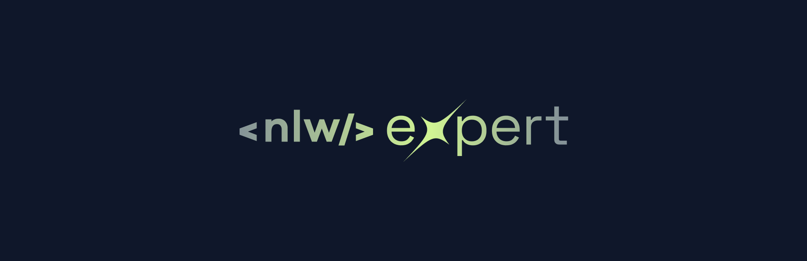
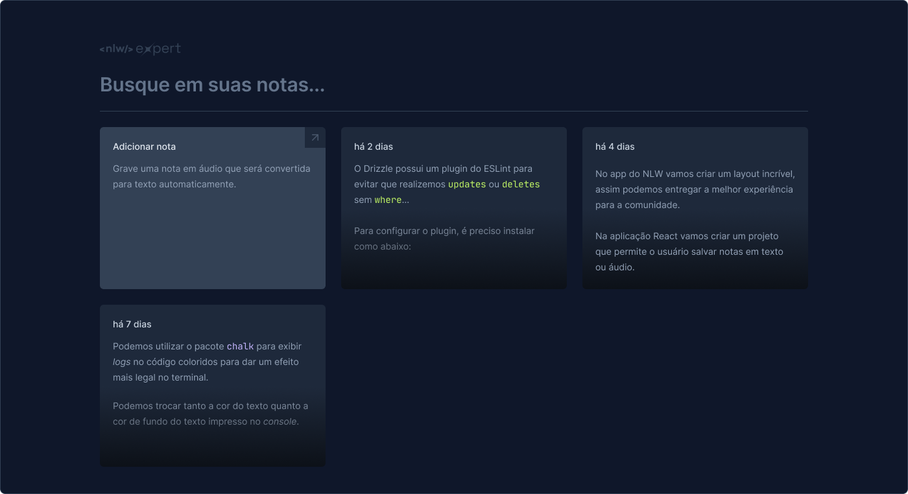

<h1 align="center">NLW Expert (React) 🗒 </h1>

 

Essa aplicação foi desenvolvida durante o NLW Experts da Rocketseat 2024 utilizando React, TypeScript, Tailwind e a SpeechRecognition API. O NLW Expert Notes tem como objetivo guardar suas anotações.

Tem funções como salvar uma nota em texto ou gravar um áudio que será convertido para texto automaticamente.

## 🔖 Layout

Você pode visualizar o layout do projeto através [DESSE LINK](https://www.figma.com/file/qCXm8KEaOvUeSIccPBlpCX/NLW-expert-%E2%80%A2-Notes-(Community)?type=design&node-id=102%3A1489&mode=design&t=NgtPW7u6Vr2CpdaY-1). É necessário ter conta no [Figma](https://figma.com) para acessá-lo.

 

.png)

.png)
.png)
(States).png)

Feito com ♥ by [@LuanaBernardino](https://www.linkedin.com/in/lubernardino/) :wave: 